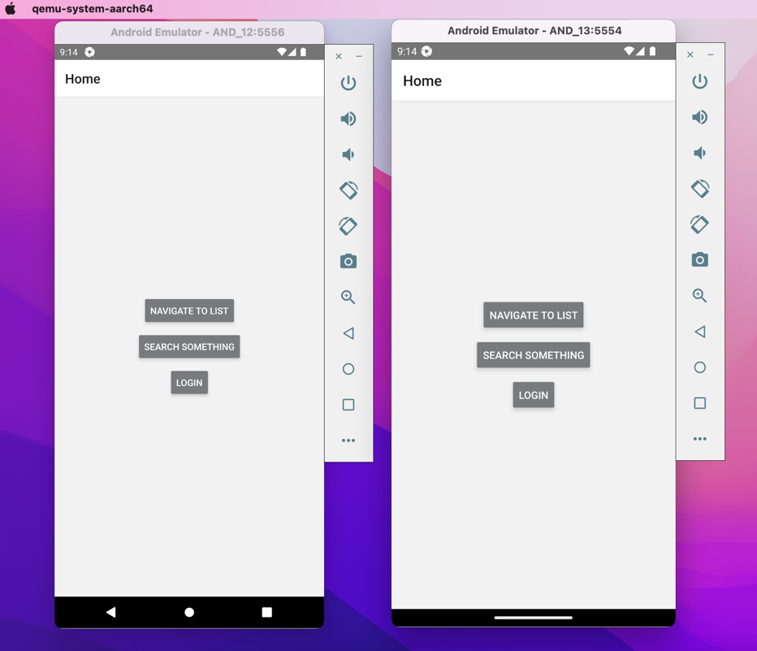

# vivid
Mobile app automation framework using appium-java bindings. :iphone:

Step 1: start appium server

Step 2: Start emulators

Step 3: Run tests

---
Run tests in parallel:

Approach no 1: Testng parallelism

Approach no 2: Appium grid and selenium grid

---

Combinations:

Android:
1. Multiple emulators
2. emulator + real devices
3. Multiple devices

iOS:
1. Multiple simulators
2. simulator + real devices (Out of scope rite now)
3. Multiple devices(Out of scope rite now)

---

---

Key points to note:
1. `systemPort` The number of the port the UiAutomator2 server is listening on. 
    By default the first free port from 8200..8299 range is selected. It is recommended to set this value if you are running parallel tests on the same machine.
2. URL of appium server session should have `wd/hub`
3. Parameter names from testng.xml should be same in method,  if you are achieving parallelism from testng.xml
4. providing path for `app` capability: fetch user.dir and combine user.dir with path of apk from content root to form absolute path. Relative path does not work here.
5. Capability type for emulators is `avd` we can also use `deviceName` as well.